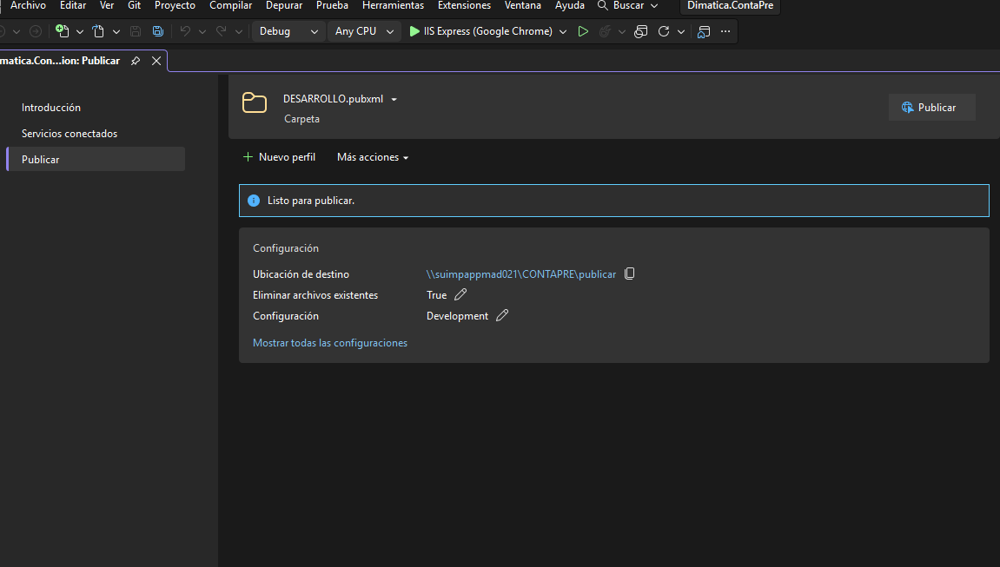

  
ÍNDICE

[1. DESCRIPCION [2](#_Toc114224949)](#_Toc114224949)

|         |          |                                |                                |
|---------|----------|--------------------------------|--------------------------------|
| Versión | Fecha    | Descripción                    | Autor(es)                      |
| 1.0.0   | 24/11/27 | Versión inicial del documento. | Jose Antonio Martinez Iglesias |

### **401. UIMP - MANUAL DE DESPLIEGUE**

#### **1. Introducción**

Este manual describe los pasos necesarios para desplegar la aplicación CONTAPRE en los entornos de **DESARROLLO** y **PRODUCCIÓN**. La aplicación se distribuye a través de una carpeta específica en el servidor, y el proceso de despliegue utiliza scripts automatizados ejecutados desde **PowerShell**.

#### **2. Propósito**

Garantizar que el despliegue de CONTAPRE sea rápido, seguro y consistente en todos los entornos, minimizando errores humanos mediante el uso de herramientas automatizadas.

#### **3. Pre-requisitos**

##### 3.1 Entornos y Configuración

**<u>DESARROLLO/PRUEBAS</u>**

- **Nombre de la maquina:** suimpappmad021

- **Sistema Operativo del Servidor:** Windows Server 2012 configurado para **.NET Framework 4.8**

- **Servidor Web:** IIS configurado con un pool de aplicaciones para CONTAPRE.

- **Framework:** **.NET Framework 4.8.**

- **Cadenas de conexión:** Configuradas correctamente en el archivo web.config.

- **Directorio servidor IIS aplicación:** C:\inetpub\wwwroot\CONTAPRE

- **Directorio código fuente:** C:\CONTAPRE\source

- **Url Web:** http://suimpappmad021.uimp.age

**<u>PRODUCCION</u>**

- **Nombre de la maquina:** suimpappmad041

- **Sistema Operativo del Servidor:** Windows Server 2012 configurado para **.NET Framework 4.8**

- **Servidor Web:** IIS configurado con un pool de aplicaciones para CONTAPRE.

- **Framework:** **.NET Framework 4.8.**

- **Cadenas de conexión:** Configuradas correctamente en el archivo web.config.

- **Directorio servidor IIS aplicación:** C:\inetpub\wwwroot\CONTAPRE

- **Url Web:** http://suimpappmad041.uimp.age

##### Archivos Necesarios en suimpappmad021

- **Carpeta: C:\CONTAPRE\publicar:** <u>Contiene el aplicativo compilado listo para desplegar</u>.

- **Subcarpeta utilities**: Scripts de **PowerShell** que automatizan el despliegue.

- **Certificado SSL:** Configurado en IIS para habilitar HTTPS en PRODUCCIÓN.

##### 3.3 Permisos

- Usuario con acceso como administrador al servidor de suimpappmad021

- Permisos para ejecutar scripts de **PowerShell**.

#### **4. Proceso de Despliegue**

##### 4.1 Preparación antes de desplegar

El primer paso es <u>compilar y publicar la solución</u>. **Es importante asegurarse que es la rama master** la que publicamos.

##### 4.1 Despliegue del proyecto compilado y publicado

1.  **Abrir una conexión a Escritorio remoto**.

    - Introducir el nombre el equipo y las credenciales

2.  **Verificar la carpeta C:\CONTAPRE\publicar:**

    - Asegúrate de que contiene la última versión del aplicativo compilado.

    - Confirma la presencia de la subcarpeta Utilities con los scripts necesarios.

3.  **Realizar un Respaldo:**

    - Respaldar la carpeta actual del sistema en IIS (si ya está desplegado).

    - Crear una copia de seguridad de las bases de datos (SQL Server y Oracle).

4.  **Notificar a los Usuarios:**

    - Informar que el sistema estará fuera de servicio durante el proceso de actualización.

##### 4.2 Despliegue con Scripts de **PowerShell**

1.  **Acceder a la Carpeta C:\CONTAPRE\publicar:**

    - Navega a esta carpeta en el servidor.

2.  **Ejecutar el Script DeployApp.ps1:**

    - En la subcarpeta Utilities, haz clic derecho sobre el archivo DeployApp.ps1.

    - Selecciona la opción **Run with PowerShell**.

3.  **Seguir las Instrucciones en Pantalla:**

    - El script pedirá confirmar el entorno de despliegue (**DESARROLLO** o **PRODUCCIÓN**).

    - Validará la configuración del servidor y copiará los archivos necesarios al directorio de la aplicación en IIS.

4.  **Verificar el Proceso:**

    - Revisa los logs generados por el script para asegurarte de que el despliegue se completó sin errores.

##### 4.3 Configuración Final en IIS

1.  **Configurar el Pool de Aplicaciones:**

    - Verifica que el pool de aplicaciones asociado esté en ejecución.

    - Asegúrate de que utiliza .NET Framework 4.8 y el modo integrado.

2.  **Configurar HTTPS (si aplica):**

    - Si es un despliegue en PRODUCCIÓN, verifica que el certificado SSL esté correctamente configurado.

3.  **Reiniciar el Pool de Aplicaciones:**

    - Desde el administrador de IIS, reinicia el pool de aplicaciones para cargar los nuevos archivos.

#### **5. Validación del Despliegue**

1.  **Probar Acceso a la Aplicación:**

    - Accede a la URL del sistema desde Google Chrome y verifica que la página principal cargue correctamente.

2.  **Ejecutar Pruebas Básicas:**

    - Realiza pruebas en los módulos principales: presupuestos, ingresos, gastos, listados y tesorería.

3.  **Monitorear el Rendimiento:**

    - Revisa los logs del sistema para asegurarte de que no haya errores o problemas de rendimiento.

#### **6. Resolución de Problemas Comunes**

| **Problema**                                      | **Solución**                                                                                                                       |
|---------------------------------------------------|------------------------------------------------------------------------------------------------------------------------------------|
| **El script de PowerShell falla al ejecutar**     | Verifica que tienes permisos de administrador y que la política de ejecución permite ejecutar scripts (Set-ExecutionPolicy).       |
| **La aplicación no carga después del despliegue** | Asegúrate de que el pool de aplicaciones está configurado y en ejecución. A veces tarda un poco la primera vez desde el despliegue |
| **Error de conexión a la base de datos**          | Confirma las cadenas de conexión en el archivo web.config y valida el acceso a las bases de datos.                                 |
| **No se aplican los cambios**                     | Limpia el caché del navegador y reinicia el pool de aplicaciones en IIS.                                                           |

#### **7. Buenas Prácticas**

1.  **Automatización:**  
    Utiliza siempre los scripts proporcionados en Utilities para evitar errores humanos.

2.  **Validación Post-Despliegue:**  
    Realiza pruebas exhaustivas para garantizar el correcto funcionamiento del sistema.

3.  **Documentación de Cambios:**  
    Registra todas las actualizaciones realizadas para mantener un historial de cambios.

4.  **Monitoreo Continuo:**  
    Supervisa los logs del sistema para detectar posibles problemas después del despliegue.

#### **8. Conclusión**

El uso de scripts de **PowerShell** para el despliegue de CONTAPRE simplifica el proceso y asegura consistencia entre entornos. Este manual proporciona los pasos detallados para garantizar que el sistema esté operativo y funcional en el menor tiempo posible.
