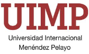

  
ÍNDICE

[1. DESCRIPCION [2](#_Toc114224949)](#_Toc114224949)

|         |          |                                |                                |
|---------|----------|--------------------------------|--------------------------------|
| Versión | Fecha    | Descripción                    | Autor(es)                      |
| 1.0.0   | 24/11/27 | Versión inicial del documento. | Jose Antonio Martinez Iglesias |

### **601. UIMP - PLAN DE PRUEBAS**

#### **1. Introducción**

El propósito de este documento es establecer un plan de pruebas para validar la funcionalidad, integración y aceptabilidad del sistema CONTAPRE. Las pruebas están diseñadas para asegurar que la aplicación cumpla con los requisitos establecidos y funcione de manera correcta en los entornos de DESARROLLO y PRODUCCIÓN.

#### **2. Tipos de Pruebas**

##### 2.1 Pruebas de Aceptación Manuales

- **Objetivo:** Validar que el sistema cumpla con los requisitos definidos y sea aceptable para los usuarios finales.

- **Responsables:** Equipo de validación y usuarios clave.

- **Metodología:**

  - Simular casos de uso reales del sistema.

  - Verificar que las funcionalidades respondan a las necesidades operativas.

##### 2.2 Pruebas de Funcionalidad Manuales

- **Objetivo:** Asegurar que cada módulo o funcionalidad del sistema opere según lo esperado.

- **Responsables:** Equipo de desarrollo y validación.

- **Metodología:**

  - Revisar cada funcionalidad del sistema siguiendo casos de prueba específicos.

  - Reportar y corregir cualquier comportamiento inesperado.

##### 2.3 Pruebas de Integración Manuales

- **Objetivo:** Verificar que los distintos módulos del sistema trabajen de manera correcta y coordinada.

- **Responsables:** Equipo de desarrollo y validación.

- **Metodología:**

  - Probar las interacciones entre la capa de presentación, lógica de negocio y base de datos.

  - Asegurar la sincronización de datos entre SQL Server y Oracle.

##### 2.4 Pruebas Unitarias

- **Objetivo:** Validar que los componentes individuales del sistema (clases, métodos, funciones) funcionen correctamente.

- **Responsables:** Equipo de desarrollo.

- **Metodología:**

  - Crear y ejecutar pruebas automatizadas en el proyecto **Dimatica.ContaPre.PresentationUnitTest**.

  - Validar el comportamiento de métodos específicos según los casos de prueba definidos.

#### **3. Entorno de Pruebas**

##### 3.1 Configuración del Entorno

- **Servidor:** Windows Server 2012.

- **Base de datos:**

  - SQL Server 12 (local).

  - Oracle 19c (remoto).

- **Navegador:** Google Chrome.

- **Herramientas de pruebas unitarias:** NUnit o equivalente integrado en Visual Studio.

##### 3.2 Datos de Prueba

- Crear un conjunto de datos ficticios representativos para ingresos, gastos y transacciones de tesorería.

- Proveer configuraciones básicas de usuarios y roles para pruebas de permisos.

#### **4. Casos de Prueba**

##### 4.1 Pruebas de Aceptación

| **ID** | **Descripción**                     | **Criterio de Aceptación**                                                                    |
|--------|-------------------------------------|-----------------------------------------------------------------------------------------------|
| PA001  | Registrar un ingreso presupuestario | El sistema debe permitir registrar un ingreso correctamente y reflejarlo en la base de datos. |
| PA002  | Consultar listados de gastos        | Los listados deben generarse según los filtros seleccionados por el usuario.                  |
| PA003  | Generar hoja de arqueo en tesorería | La hoja debe generarse con los datos proporcionados y sin errores de validación.              |

##### 4.2 Pruebas de Funcionalidad

| **ID** | **Módulo**   | **Descripción**                     | **Resultado Esperado**                      |
|--------|--------------|-------------------------------------|---------------------------------------------|
| PF001  | Presupuestos | Modificar un crédito presupuestario | El crédito debe actualizarse correctamente. |
| PF002  | Tesorería    | Registrar un pago                   | El pago debe reflejarse en los listados.    |
| PF003  | Gastos       | Consultar expedientes de gastos     | Mostrar datos correctos en la interfaz.     |

##### 4.3 Pruebas de Integración

| **ID** | **Módulos Involucrados**           | **Descripción**                      | **Resultado Esperado**                                                       |
|--------|------------------------------------|--------------------------------------|------------------------------------------------------------------------------|
| PI001  | Presentación y Lógica de Negocio   | Registrar un ingreso                 | Validar que la lógica de negocio procese correctamente los datos ingresados. |
| PI002  | Lógica de Negocio y Base de Datos  | Actualizar un registro en SQL Server | Verificar que los cambios se reflejen en la base de datos.                   |
| PI003  | Bases de Datos SQL Server y Oracle | Sincronización de datos entre bases  | Validar que los datos en ambas bases sean consistentes.                      |

##### 4.4 Pruebas Unitarias

| **ID** | **Módulo**        | **Método Probado**       | **Resultado Esperado**                                     |
|--------|-------------------|--------------------------|------------------------------------------------------------|
| PU001  | Lógica de Negocio | CalcularTotalPresupuesto | Retornar el cálculo correcto de ingresos menos gastos.     |
| PU002  | Lógica de Negocio | ValidarPermisosUsuario   | Retornar true si el usuario tiene permisos válidos.        |
| PU003  | Acceso a Datos    | ObtenerListaDeGastos     | Retornar todos los gastos registrados en la base de datos. |

#### **5. Proceso de Ejecución de Pruebas**

1.  **Planificación:**

    - Identificar qué pruebas se ejecutarán en cada iteración de desarrollo.

    - Asignar responsabilidades al equipo de pruebas.

2.  **Ejecución:**

    - Realizar pruebas manuales en los módulos específicos, registrando los resultados.

    - Ejecutar pruebas unitarias en el entorno de desarrollo.

3.  **Registro de Resultados:**

    - Documentar cualquier error o comportamiento inesperado en un registro centralizado.

4.  **Corrección:**

    - Notificar al equipo de desarrollo sobre los errores encontrados.

    - Validar las correcciones aplicadas.

#### **6. Resolución de Problemas Comunes**

| **Problema**                                | **Solución**                                                                                       |
|---------------------------------------------|----------------------------------------------------------------------------------------------------|
| **La base de datos no devuelve resultados** | Verificar las conexiones en el archivo web.config y confirmar que las tablas tengan datos válidos. |
| **El listado no se genera correctamente**   | Validar que los filtros aplicados sean correctos y revisar los procedimientos almacenados.         |
| **Prueba unitaria falla**                   | Revisar el método probado para garantizar que cumple con los requisitos funcionales.               |

#### **7. Conclusión**

Este plan de pruebas asegura que todas las funcionalidades principales del sistema CONTAPRE sean validadas de manera exhaustiva mediante pruebas manuales y unitarias. Su correcta implementación garantizará que el sistema funcione según lo esperado en producción.

### 
