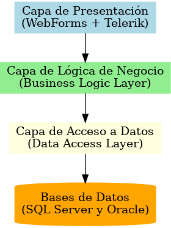
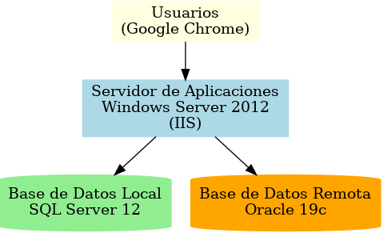
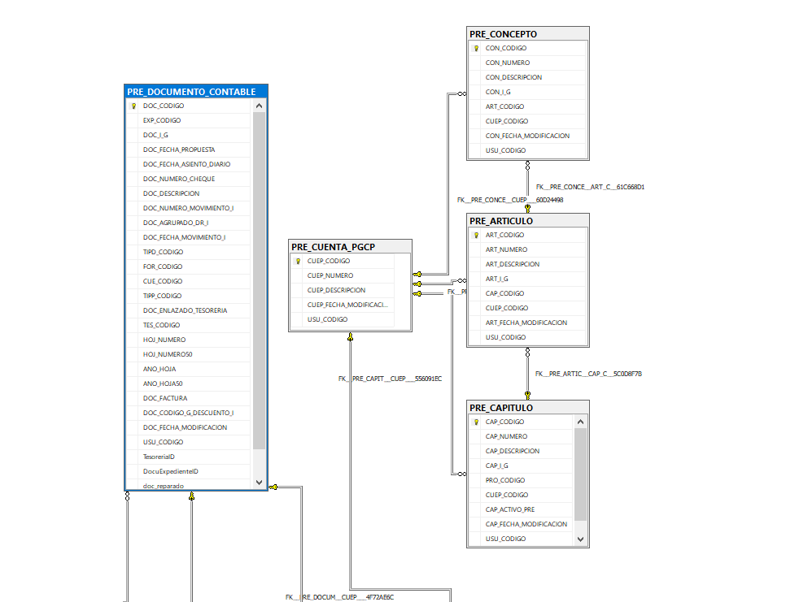

  
### **801. UIMP - DIAGRAMAS Y ARQUITECTURA**

#### **1. Introducción**

Este documento describe la arquitectura general del sistema CONTAPRE, detallando su organización a nivel de capas y componentes principales. El objetivo es proporcionar una visión clara y estructurada del diseño del sistema para facilitar su comprensión, mantenimiento y evolución.

#### **2. Propósito**

El propósito de este documento es:

- Explicar cómo se organizan las capas del sistema CONTAPRE.

- Identificar los flujos de datos y las dependencias entre las capas.

- Servir como referencia para el equipo de desarrollo y mantenimiento.

#### **3. Arquitectura General del Sistema**

CONTAPRE sigue una arquitectura multicapa, donde cada capa tiene responsabilidades específicas. Esto asegura una separación de responsabilidades, facilita el mantenimiento y mejora la escalabilidad del sistema.

##### 3.1 Capas Principales

1.  **Capa de Presentación (Presentation Layer):**

    - Interfaz de usuario basada en WebForms.

    - Componentes Telerik utilizados para mejorar la experiencia del usuario.

    - Gestiona las interacciones con el usuario y envía las solicitudes a la capa de lógica de negocio.

2.  **Capa de Lógica de Negocio (Business Logic Layer - BLL):**

    - Implementa las reglas de negocio.

    - Coordina la comunicación entre la capa de presentación y la capa de acceso a datos.

    - Valida los datos y aplica las reglas antes de procesarlos.

3.  **Capa de Acceso a Datos (Data Access Layer - DAL):**

    - Gestiona la interacción con las bases de datos.

    - Contiene los métodos para realizar operaciones CRUD (Crear, Leer, Actualizar, Eliminar) en SQL Server y Oracle.

4.  **Bases de Datos (Database Layer):**

    - Contiene las bases de datos SQL Server (local) y Oracle (remota).

    - Almacena todos los datos necesarios para las operaciones del sistema.

    - Las bases de datos están sincronizadas para garantizar consistencia en la información.

#### **4. Diagrama de Arquitectura**

El siguiente diagrama representa la arquitectura de CONTAPRE a nivel de capas:

#### **5. Flujos de Datos**

1.  **Desde la Capa de Presentación a la Lógica de Negocio:**

    - El usuario interactúa con los formularios de WebForms, y los datos ingresados se envían a la capa de lógica de negocio para ser procesados.

2.  **Desde la Lógica de Negocio a la Capa de Acceso a Datos:**

    - La lógica de negocio realiza validaciones y llama a los métodos de la capa de acceso a datos para interactuar con las bases de datos.

3.  **Desde la Capa de Acceso a Datos a las Bases de Datos:**

    - Las operaciones solicitadas se traducen en consultas SQL o llamadas a procedimientos almacenados en SQL Server y Oracle.

#### **6. Beneficios de la Arquitectura**

- **Separación de responsabilidades:** Cada capa tiene funciones claramente definidas, lo que facilita el mantenimiento y la ampliación del sistema.

- **Escalabilidad:** La arquitectura permite añadir nuevas funcionalidades sin afectar significativamente a las capas existentes.

- **Reutilización:** Los componentes de la lógica de negocio y acceso a datos pueden ser reutilizados en otros proyectos similares.

#### **7. Separación Física**

El sistema CONTAPRE está diseñado con una arquitectura distribuida que separa los componentes en diferentes niveles físicos para garantizar un rendimiento óptimo, escalabilidad y seguridad. La separación física de los componentes es la siguiente:

1.  **Servidor de Aplicaciones**

    - **Descripción:**  
      El servidor principal aloja la aplicación web y ejecuta la lógica de negocio. Está configurado en un entorno Windows Server 2012 con IIS como servidor web.

    - **Funciones principales:**

      - Gestionar solicitudes de los usuarios (clientes web).

      - Procesar la lógica de negocio.

      - Conectarse a las bases de datos para operaciones CRUD.

    - **Ubicación:**  
      Instalado en la infraestructura de la organización.

2.  **Base de Datos Local - SQL Server**

    - **Descripción:**  
      SQL Server 12 gestiona la base de datos local que almacena los datos principales relacionados con presupuestos, ingresos, gastos, y tesorería.

    - **Funciones principales:**

      - Almacenar los datos transaccionales del sistema.

      - Servir como repositorio para consultas rápidas y generación de reportes.

    - **Ubicación:**  
      En el mismo servidor físico que el servidor de aplicaciones.

3.  **Base de Datos Remota - Oracle**

    - **Descripción:**  
      Oracle 19c se utiliza para gestionar datos interoperables con otros sistemas externos.

    - **Funciones principales:**

      - Gestionar datos que requieren interoperabilidad con otros sistemas externos.

      - Proporcionar redundancia y soporte a funcionalidades específicas.

    - **Ubicación:**  
      En un servidor remoto independiente con acceso restringido.

4.  **Clientes (Usuarios)**

    - **Descripción:**  
      Los usuarios acceden a CONTAPRE mediante un navegador web (Google Chrome).

    - **Funciones principales:**

      - Interactuar con la interfaz de usuario de la aplicación web.

      - Enviar solicitudes al servidor de aplicaciones y recibir respuestas.

    - **Ubicación:**  
      Estaciones de trabajo distribuidas en la organización.

#### **Conexiones entre Componentes**

1.  **Clientes a Servidor de Aplicaciones:**

    - Protocolo: HTTPS.

    - Función: Permite a los usuarios interactuar con la aplicación de manera segura.

2.  **Servidor de Aplicaciones a SQL Server:**

    - Protocolo: Conexión directa mediante ADO.NET o similar.

    - Función: Realiza operaciones transaccionales como consultas, inserciones, y actualizaciones de datos.

3.  **Servidor de Aplicaciones a Oracle:**

    - Protocolo: ODP.NET o similar para conectarse a la base de datos remota.

    - Función: Sincroniza y recupera datos necesarios para funcionalidades específicas del sistema.

Este diseño de separación física asegura que cada componente cumple un propósito específico, optimizando el uso de recursos y facilitando el mantenimiento del sistema.

#### **8.Visualización del Modelo de Datos**

El diagrama mostrado representa el modelo de datos de la base de datos utilizada por el sistema CONTAPRE. Para visualizar y trabajar con este tipo de diagramas en SQL Server Management Studio (SSMS), es necesario habilitar la funcionalidad de diagramas de base de datos:

1.  **Habilitar Diagramas:**

    - Desde SQL Server Management Studio (SSMS), selecciona la base de datos correspondiente en el panel **Object Explorer**.

    - Si la carpeta **Database Diagrams** no está habilitada:

      - Haz clic derecho en la base de datos.

      - Selecciona **Tasks \> Enable Database Diagramming**.

2.  **Acceder al Diagrama:**

    - Expande la carpeta **Database Diagrams**.

    - Si ya existe un diagrama, haz doble clic sobre él para abrirlo.

    - Si necesitas crear uno nuevo:

      - Haz clic derecho sobre la carpeta **Database Diagrams**.

      - Selecciona **New Database Diagram**.

      - Agrega las tablas que desees incluir en el diagrama.

3.  **Modificar y Guardar:**

    - Puedes modificar el diagrama organizando las tablas, añadiendo o eliminando relaciones, y guardando los cambios para futuras referencias.

#### **9. Consideraciones**

- Asegurar la integridad de los datos al sincronizar SQL Server y Oracle.

- Implementar pruebas unitarias e integrales para validar el funcionamiento correcto de cada capa.

- Monitorizar el rendimiento de las bases de datos para evitar cuellos de botella.

###### **Consulta Adicional**

Para obtener más información sobre configuraciones específicas del sistema, especificaciones de hardware, configuraciones de red o cualquier detalle técnico adicional relacionado con la infraestructura del sistema CONTAPRE, se recomienda contactar con el **Departamento de Informática** de la UIMP.

Este equipo es responsable de la gestión, configuración y soporte de los entornos de desarrollo, pruebas y producción, así como de la administración de los servidores y bases de datos.

#### **10. Conclusión**

El diseño arquitectónico de CONTAPRE garantiza un sistema modular y escalable, preparado para cumplir con los requisitos actuales y futuros de la organización. Este documento proporciona una referencia para el desarrollo y mantenimiento del sistema.

### 
